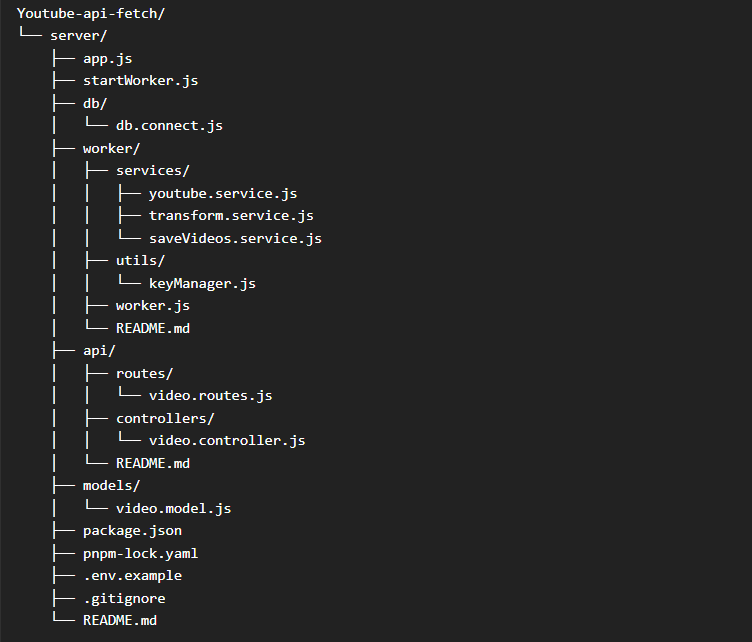
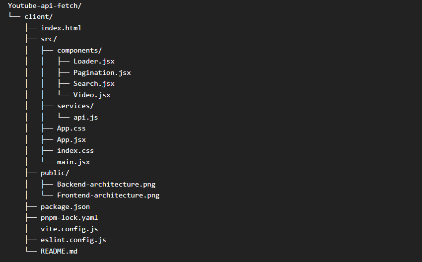

# Youtube Fetch API
Project link: [Youtube Fetch](https://youtube.fouzan.dev)

## Architecture

### Server usage
1. Clone the repository.
2. Install dependencies (ex: npm i, pnpm i).
3. Create a .env file and fill according to .env.example (ex: PORT = 5000).
4. Make sure you add the MongoDB URI.
5. Run the server using npm run start or pnpm run start depending on your package manager.
6. Go to Postman or any other API testing platforms.
7. Call the APIs, there are two of them. 
8. Example APIs.

http://localhost:5000/api/videos 

http://localhost:5000/api/videos/search/?q=dhoni&page=1&limit=20

# youtube-api-fetch
Serri-AI backend assignment.
